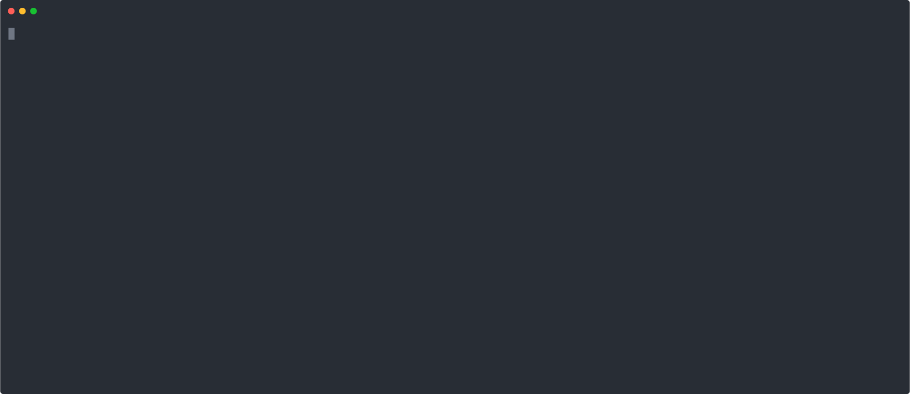
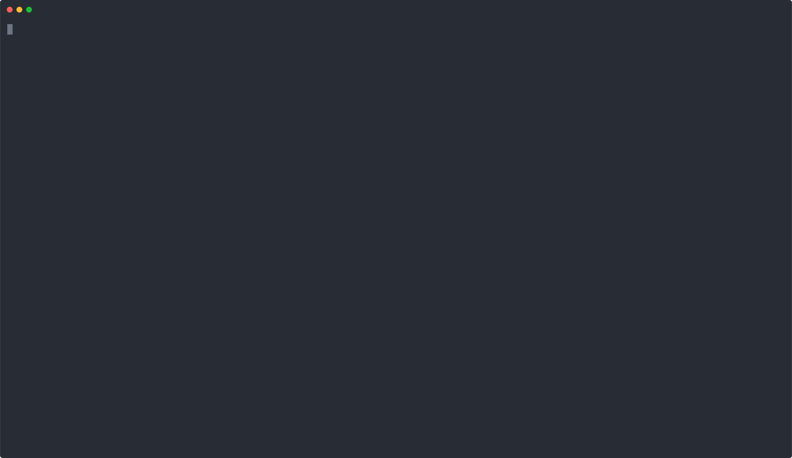

<!--
*** Thanks for checking out the Best-README-Template. If you have a suggestion
*** that would make this better, please fork the repo and create a pull request
*** or simply open an issue with the tag "enhancement".
*** Thanks again! Now go create something AMAZING! :D
***
***
***
*** To avoid retyping too much info. Do a search and replace for the following:
*** maxidev, btcli, twitter_handle, email, BTCli - A Simple Bitcoin command-line explorer, BTCli - A Simple Bitcoin command-line explorer
-->


<!-- PROJECT SHIELDS -->
<!--
*** I'm using markdown "reference style" links for readability.
*** Reference links are enclosed in brackets [ ] instead of parentheses ( ).
*** See the bottom of this document for the declaration of the reference variables
*** for contributors-url, forks-url, etc. This is an optional, concise syntax you may use.
*** https://www.markdownguide.org/basic-syntax/#reference-style-links
-->
[![Contributors][contributors-shield]][contributors-url]
[![Forks][forks-shield]][forks-url]
[![Stargazers][stars-shield]][stars-url]
[![Issues][issues-shield]][issues-url]
[![MIT License][license-shield]][license-url]

<!-- PROJECT LOGO -->
<br />
<p align="center">

  <h3 align="center">BTCli - A Simple Bitcoin command-line explorer</h3>
  <p align="center">
    <a href="https://github.com/maxidev/btcli/issues">Report Bug</a>
    ·
    <a href="https://github.com/maxidev/btcli/issues">Request Feature</a>
  </p>
</p>


<!-- TABLE OF CONTENTS -->
<details open="open">
  <summary><h2 style="display: inline-block">Table of Contents</h2></summary>
  <ol>
    <li>
      <a href="#about-the-project">About The Project</a>
      <ul>
        <li><a href="#built-with">Built With</a></li>
      </ul>
      <ul>
        <li><a href="#not-a-wallet">Not a Wallet</a></li>
      </ul>
    </li>
    <li>
      <a href="#getting-started">Getting Started</a>
      <ul>
        <li><a href="#prerequisites">Prerequisites</a></li>
        <li><a href="#installation">Installation</a></li>
      </ul>
    </li>
    <li><a href="#usage">Usage</a></li>
    <li><a href="#roadmap">Roadmap</a></li>
    <li><a href="#contributing">Contributing</a></li>
    <li><a href="#license">License</a></li>
    <li><a href="#contact">Contact</a></li>
    <li><a href="#acknowledgements">Acknowledgements</a></li>
  </ol>
</details>


<!-- ABOUT THE PROJECT -->
## About The Project
BTCli aims to be a dev-friendly, simple Bitcoin terminal explorer to easly check for address balance, transaction information, UTXOs and more.
It actually supports Bitcoin Mainnet and Testnet, and different web explorer can be chosen to preset the terminal links.

*BTCli is NOT a wallet!*

See examples below.

### Built With

* [ElectrumX](https://electrumx.readthedocs.io/en/latest/protocol-basics.html)
* [NodeJS](https://nodejs.org)

### Not a Wallet

BTCli aims to be a useful command line tool for quick checking Bitcoin blockchain address and transactions. BTCli is not a wallet, for a good wallet experience we recommend to use one of the following:

* [Specter Wallet](https://github.com/cryptoadvance/specter-desktop) (Great MultiSig focused wallet that interacts directly with Bitcoin Core)
* [Blue Wallet](https://github.com/BlueWallet/BlueWallet) (User friendly and multisig capable Mobile wallet for Android and iOS)

<!-- GETTING STARTED -->
## Getting Started

To run BTCli in your local machine directly from this repository
### Clone the project
  ```sh
  git clone git@github.com:maxidev/btcli.git
  ```

### Install dependencies

nodejs/npm version 10+

  ```sh
  npm i
  ```

Now you can just run:

```sh
node ./bin/btcli.js <command>
```

### To bind the binary and use directly on the terminal

   ```js
   //This will bind btcli commandline to js entry point
   sudo npm link
   ```

Then you can just run:

```sh
btcli <command>
```

### To generate a .deb (Debian/Ubuntu) package 

First install dependencies by running

```sh
sudo npm install -g node-deb
sudo apt-get install jq
```
Then

```
npm run generate:deb
```

This will trigger script to generate btcli_0.0.1_all.deb for easily installation, on Debian/Ubuntu systems:

```
sudo dpkg -i btcli_0.0.1_all.deb
```

To install directly from NPM:

### Install as a global package
  ```sh
  npm install -g btcli
  ```

### Once installed, just run it from command line

```
btcli help

Usage: btcli [options] [command]

BTCli - A simple command line Bitcoin explorer

Options:
  -v, --version                                    Output the current version
  -e, --explorer <explorer>, Web Explorer to link   (choices: "blockchair", "blockchain-info", "blockstream", "btc")
  --tojson [filename]                              JSON Output
  -V, --verbose                                    Verbose output
  -t, --testnet                                    Set Bitcoin testnet network
  -h, --help                                       display help for command

Commands:
  addr <address>                                   Bitcoin Address to check legacy/bech32 supported
  block <height>                                   Bitcoin block information
  tx <transaction>                                 Bitcoin transaction
  help [command]                                   display help for command
```
<!-- USAGE EXAMPLES -->
## Usage

btcli _addr_ command usage 



btcli _tx_ command usage 



Testnet
btcli testnet option usage 


JSON Format
btcli _tojson_ option usage 


### Commands

- `addr <address>` Bitcoin Address to check legacy P2PKH/P2SH/P2WPKH (SegWit Bech32) supported.
- `block <height>` Bitcoin block information (under development)
- `tx <transaction>` Bitcoin transaction.

### Options

- `--verbose` Output reloaded.
- `--explorer <explorer>` Web explorer to link.
- `--tojson <filename>` Output logs in json.
- `--testnet` Set tesnet chain for querying servers

### Examples

```js
// Simple Bitcoin mainnet legacy address balance check
btcli addr 12pPx8Frg5wTQmprxBLoi8R3mdmFYjmCfv
```

```js
// Transaction inspect with verbose option to output inputs/outputs info
btcli tx aafe3d76554df980482ec092630ba957dda6458c40178dab54fa44443706808c --verbose
```

```js
// Inspect transaction changing the default web-explorer for output links
btcli tx aafe3d76554df980482ec092630ba957dda6458c40178dab54fa44443706808c -e blockstream
```

```js
// Address balance check with verbose option to out scripts and changing default web explorer
btcli addr 12pPx8Frg5wTQmprxBLoi8R3mdmFYjmCfv --explorer blockchain-info
```


```js
// Exporting the transaction inspect to my_tx JSON file.
btcli tx aafe3d76554df980482ec092630ba957dda6458c40178dab54fa44443706808c --tojson my_tx
```


```js
// Inspecting testnet address with verbose output
btcli addr tb1qxp7yuclrt65cvawfnpvgg3u8p2nf8qhx7k9jzf --verbose --testnet
```

<!-- ROADMAP -->
## Roadmap

We have lots of ideas to convert BTCli into a swiss-army knife tool for devs and enthusiast alike. This is a side project and collaboration is much needed. Feel free to open some issue to propose a new feature.

See the [open issues](https://github.com/maxidev/btcli/issues) for a list of proposed features (and known issues).

<!-- CONTRIBUTING -->
## Contributing

Contributions are what make the open source community such an amazing place to be learn, inspire, and create. Any contributions you make are **greatly appreciated**.

1. Fork the Project
2. Create your Feature Branch (`git checkout -b feature/AmazingFeature`)
3. Commit your Changes (`git commit -m 'Add some AmazingFeature'`)
4. Push to the Branch (`git push origin feature/AmazingFeature`)
5. Open a Pull Request


<!-- LICENSE -->
## License

Distributed under the MIT License. See `LICENSE` for more information.


<!-- CONTACT -->
## Contact

Maxi Dev - [@op_hash160](https://twitter.com/op_hash160)

Agustin Fiorenza - [@agufiorenza](https://twitter.com/agufiorenza)

Project Link: [https://github.com/maxidev/btcli](https://github.com/maxidev/btcli)


<!-- ACKNOWLEDGEMENTS -->
## Acknowledgements

This project heavily relies on [ElectrumX](https://electrumx.readthedocs.io/en/latest/protocol-basics.html) public [servers](https://1209k.com/bitcoin-eye/ele.php?chain=btc)
Consider running your own sever or donate to public server maintainers. 
We purposely left the ElectrumX Public Server connection banner on BTCli to support server owner.

## Support us!

Consider buying us a coffee if you find BTCli useful

[bc1qldcc5k2zaz4f4d79m07zgh9nc2gr7mf0nr0g8t](https://blockchair.com/bitcoin/address/bc1qldcc5k2zaz4f4d79m07zgh9nc2gr7mf0nr0g8t)


<!-- MARKDOWN LINKS & IMAGES -->
<!-- https://www.markdownguide.org/basic-syntax/#reference-style-links -->
[contributors-shield]: https://img.shields.io/github/contributors/maxidev/repo.svg?style=for-the-badge
[contributors-url]: https://github.com/maxidev/btcli/graphs/contributors
[forks-shield]: https://img.shields.io/github/forks/maxidev/repo.svg?style=for-the-badge
[forks-url]: https://github.com/maxidev/btcli/network/members
[stars-shield]: https://img.shields.io/github/stars/maxidev/repo.svg?style=for-the-badge
[stars-url]: https://github.com/maxidev/btcli/stargazers
[issues-shield]: https://img.shields.io/github/issues/maxidev/repo.svg?style=for-the-badge
[issues-url]: https://github.com/maxidev/btcli/issues
[license-shield]: https://img.shields.io/github/license/maxidev/repo.svg?style=for-the-badge
[license-url]: https://github.com/maxidev/btcli/blob/master/LICENSE.txt
[linkedin-shield]: https://img.shields.io/badge/-LinkedIn-black.svg?style=for-the-badge&logo=linkedin&colorB=555
